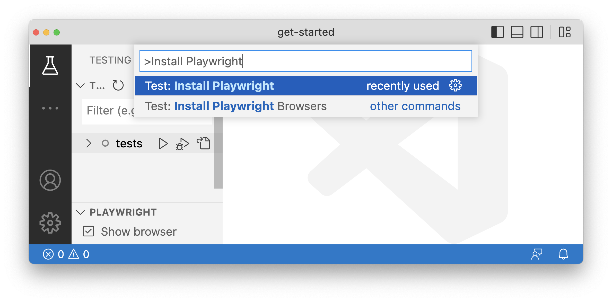

# Installation Notes

## Environment

Node Installation: **v18.16.1**

## Setup WebGME

I stepped back through the [README](../README), where I encountered errors. Details on installation machine found [here](dev-notes/installation-machine-details).

### TypeScript Installation

==Might be useful to mention the installation of TypeScript needed for a novice user.==

```shell
npm install -g typescript
```

### WebGME Install (first pass)

After this, I ended up having to run `npm install --force` in order to get past errors I was receiving.

> C:\_\wl\webgme-taxonomy>npm install
> npm ERR! code ERESOLVE
> npm ERR! ERESOLVE unable to resolve dependency tree
> npm ERR!
> npm ERR! While resolving: webgme-taxonomy@1.2.2
> npm ERR! Found: webgme@2.44.0-beta
> npm ERR! node*modules/webgme
> npm ERR! webgme@"github:webgme/webgme#azure" from the root > project
> npm ERR!
> npm ERR! Could not resolve dependency:
> npm ERR! peer webgme@"^2.23.0" from webgme-json-importer@1.4.1
> npm ERR! node_modules/webgme-json-importer
> npm ERR! webgme-json-importer@"^1.4.1" from the root project
> npm ERR!
> npm ERR! Fix the upstream dependency conflict, or retry
> npm ERR! this command with --force or --legacy-peer-deps
> npm ERR! to accept an incorrect (and potentially broken) > dependency resolution.
> npm ERR!
> npm ERR!
> npm ERR! For a full report see:
> npm ERR! > C:\Users\westerd\AppData\Local\npm-cache_logs\2023-07-11T19_59_13*> 978Z-eresolve-report.txt
>
> npm ERR! A complete log of this run can be found in:
> npm ERR! > C:\Users\westerd\AppData\Local\npm-cache_logs\2023-07-11T19*59_13*> 978Z-debug-0.log

[[installation/logs/2023-07-11T19_59_13_978Z-eresolve-report.txt]]
[[installation/logs/2023-07-11T20_28_29_175Z-debug-0.log]]

Running `npm install --force`, however, permitted install with errors (see [[dev-notes/installation-npm-install]])

I ran `npm audit fix` in order to resolve non-breaking issues, and I received the following.

> C:\_\wl\webgme-taxonomy>npm audit fix
> npm ERR! code ERESOLVE
> npm ERR! ERESOLVE unable to resolve dependency tree
> npm ERR!
> npm ERR! While resolving: webgme-taxonomy@1.2.2
> npm ERR! Found: webgme@2.44.0-beta
> npm ERR! node_modules/webgme
> npm ERR! webgme@"github:webgme/webgme#azure" from the root > project
> npm ERR!
> npm ERR! Could not resolve dependency:
> npm ERR! peer webgme@"^2.23.0" from webgme-json-importer@1.4.1
> npm ERR! node_modules/webgme-json-importer
> npm ERR! webgme-json-importer@"^1.4.1" from the root project
> npm ERR!
> npm ERR! Fix the upstream dependency conflict, or retry
> npm ERR! this command with --force or --legacy-peer-deps
> npm ERR! to accept an incorrect (and potentially broken) > dependency resolution.
> npm ERR!
> npm ERR!
> npm ERR! For a full report see:
> npm ERR! > C:\Users\westerd\AppData\Local\npm-cache_logs\2023-07-11T20_28_29> 175Z-eresolve-report.txt
>
> npm ERR! A complete log of this run can be found in:
> npm ERR! > C:\Users\westerd\AppData\Local\npm-cache_logs\2023-07-11T20_28_29_175Z-debug-0.log

[[installation/logs/2023-07-11T20_28_29_175Z-eresolve-report.txt]]
[[installation/logs/2023-07-11T20_28_29_175Z-debug-0.log]]

### MongoDB

Connection String: **mongodb://localhost:27017**

### WebGME Install (second pass)

I ran `npm install` with results showing in [[installation/logs/npm-install.log]] There were several warnings, and a few issues not otherwise specified as warning:

> src/main.ts → public/build/bundle.js...
> (!) Circular dependencies
> node_modules/@smui/textfield/node_modules/@smui/common/dist/index.> js -> node_modules/@smui/textfield/node_modules/@smui/common/dist/> CommonLabel.svelte -> node_modules/@smui/textfield/node_modules/> @smui/common/dist/index.js
> node_modules/@smui/textfield/node_modules/@smui/common/dist/index.> js -> node_modules/@smui/textfield/node_modules/@smui/common/dist/> CommonIcon.svelte -> node_modules/@smui/textfield/node_modules/> @smui/common/dist/index.js
> node_modules/@smui/list/node_modules/@smui/common/dist/index.js > -> node_modules/@smui/list/node_modules/@smui/common/dist/> CommonLabel.svelte -> node_modules/@smui/list/node_modules/@smui/> common/dist/index.js
> ...and 15 more

> src/TaxonomyReference.ts → dist/TaxonomyReference.js...
> (!) Plugin typescript: @rollup/plugin-typescript: Rollup > 'sourcemap' option must be set to generate source maps.
> (!) Mixing named and default exports
> https://rollupjs.org/guide/en/#outputexports

I did not see a script for WebGME (i.e. `webgme start`), and when I ran from the command line, the executable could not be found.

## Setup PlayWrite

I attempted to install PlayWrite through VSCode in order take advantage of the extension, [Playwright Test for VSCode](https://github.com/microsoft/playwright-vscode). The instructions detailed installation via VSCode as shown in the image below.



This failed (likely Windows), so I ran the command at an admin command line.

```shell
npm init playwright@latest --yes -- --quiet --browser=chromium --gha
```

I reconfigured [[playwright.config.ts]] to point to the __e2e__ folder.

> export default defineConfig({
>   ==testDir: './e2e',==
>   /* Run tests in files in parallel */
>   fullyParallel: true,
>   /* Fail the build on CI if you accidentally left test.only in > the source code. */
>   forbidOnly: !!process.env.CI,


