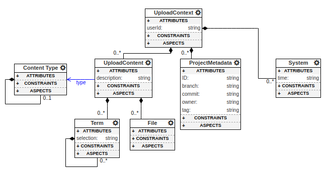

Advanced Concepts
=================

System Terms
^^^^^^^^^^^^
System terms are terms which are assigned automatically by the design studio when data is uploaded to the UDCP. A few examples of system terms can be found in the base vocabulary. These include `name`, `content`, and `taxonomy`. As they are not created by users, they are not shown in the tag forms. They can still be used to filter search results from the data dashboard.

Defining System Terms
---------------------
Defining a system term starts the same way as defining any other term. That is, it is created in a vocabulary and its name and properties must be defined as child nodes in the design studio. After defining the structure of the term, system terms must define how to create the tag when  content is uploaded. This is defined in the form of a model transformation (using `webgme-transformations <https://github.com/brollb/webgme-transformations>`_). In the context of Model-Integrated Computing, model transformations enable designers to specify how to transform or generate a model given an input model. (In this context `model` refers generically to a representation of data in a design studio.) In the context of system terms, the input model is metadata about the data uploaded to UDCP and the generated model is a model of the tags to apply to it. The transformation consists of rules which, given a pattern in the input model, produces an output pattern. The output pattern may reference content from the input model.

For example, consider the `name` system term from the base vocabulary. It is a term with a single property, `value`. Since it is a system term, it also defines a transformation. Both the property and the transformation are shown in the figure below.

    System terms contain both the defined properties and the transformation to create them.    

As the "name" system term is part of the base vocabulary, it is applied to all content uploaded to the UDCP. The transformation defines that it should create a "name" tag for the uploaded content and set the "property" value to the actual name of the upload. The formal definition for this system term is shown below.

    An example transformation defining how the "name" tag is applied by the system on data upload.

Upload Context
--------------

The upload context contains the relevant metadata about the uploaded content. This includes the name, description, and type of the content as well as the project metadata. The formal definition of the concepts in an upload context are given below.

    The formal definition of the upload context metadata.

When data is uploaded to the UDCP, the above formal definitions are used to construct an instance of an upload context. This upload context is then passed as the input model to the transformations to create the tags!
