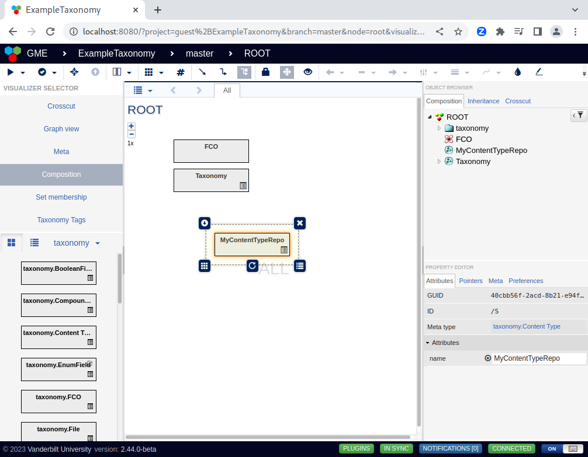
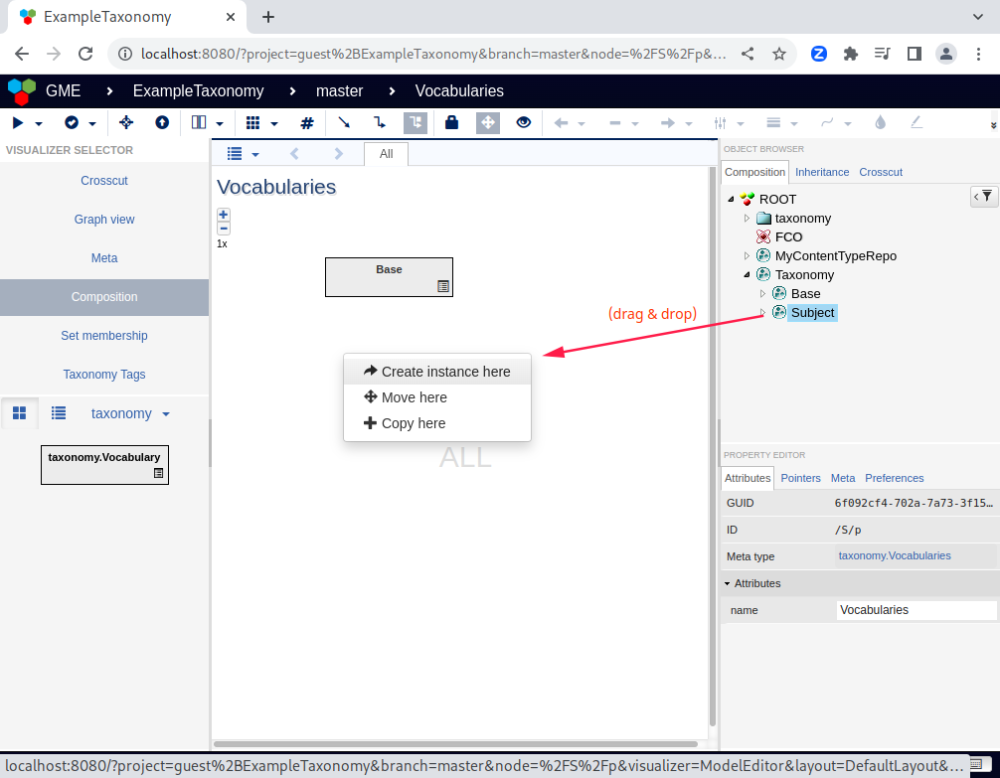
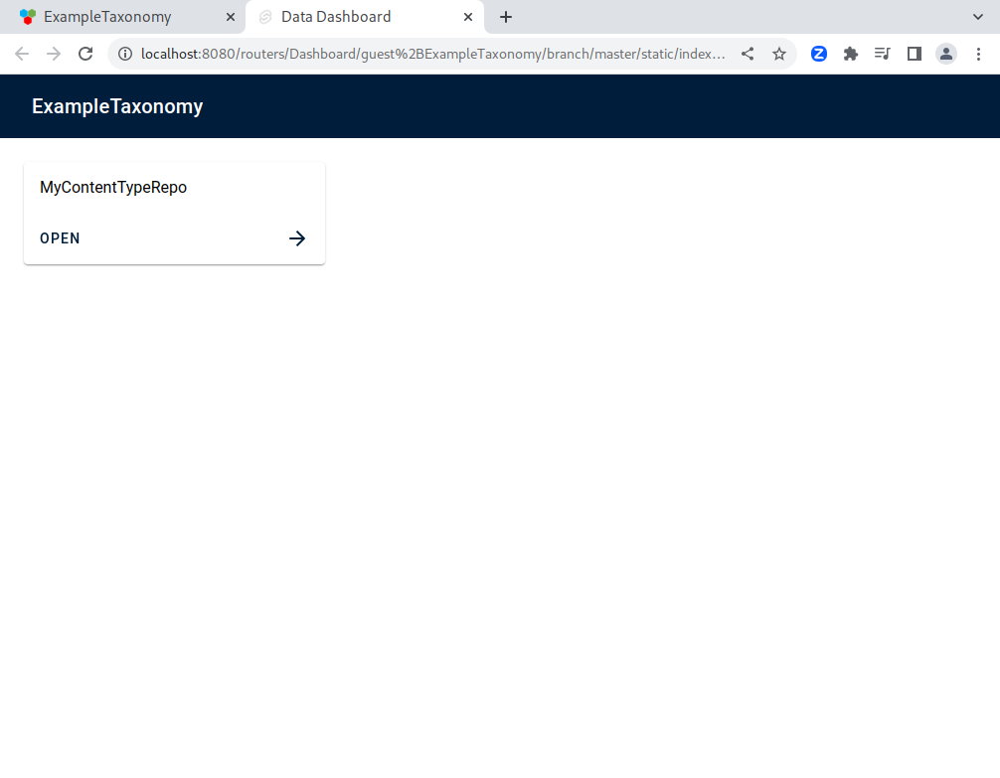

Creating Content Types
----------------------

After creating a taxonomy composed of one or more vocabularies, we can now define a content type! To review, content type consists of 3 or 4 elements:

- name
- vocabularies to use for tagging this type of content
- storage information (for retrieving the actual data)
- any nested content types representing contained content

In this walkthrough, we will be modeling a content type that consists of repositories of artifacts. That is, we will be modeling hierarchical content consisting of 2 content types.

First, let's create the content type for the top level content (ie, the repositories). To add our own content type, we will first drag a "ContentType" (aka "taxonomy.Content Type") node from the part browser in the lower left into the project alongside (not within) the taxonomy node. After adding the new content type, we can select it and then set its name from the pane on the lower right.

    Set the name of a new content type definition in the lower right pane.

After we name the content type, we just need to define the storage information for this content type. That is, we need to specify where this content can be found. First, open (double click) the content type definition. Next, select a storage adapter to use from the part browser and drag it into the content type node. The storage adapter likely has additional parameters that will need to be set. These can be configured by selecting the newly created node and editing the fields in the lower right pane.

.. figure:: create_storage.png
    :align: center

    Define the storage information to specify where to store and retrieve this type of content.

Next, we can define the valid vocabularies for the content type (ie, the repositories). First, we create a "Vocabularies" container in the content type by dragging it from the lower left pane. Then, we can drag vocabularies from the tree browser in the top right into the center. After dropping them in the vocabularies container, select "Create an instance" to add them to the set of valid vocabularies.

    Create a vocabularies container for the content type.

    Add a vocabulary to the set of valid vocabularies for a content type by dragging from the tree browser.

Since we would like to model hierarchical content, we will now follow the same process to create a content type within this newly created content type. However, since this content type is contained in the parent, we will not define storage information. It is worth noting that we are not restricting to the same valid vocabularies for the repositories and artifacts in the repository. There may be tags, such as principle investigator or site, which we would like to associate with the entire repository rather than a single uploaded artifact.

After we model the contained content type, our content type(s) should be complete! If we open the content type dashboard as shown below, we should see the new content type listed!

    Open the content type dashboard to view all defined content types.

    Now, we can see our new content type on the dashboard!

