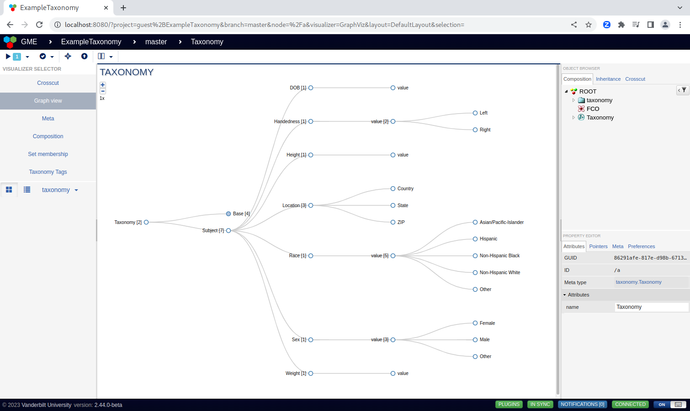

Creating Taxonomies
-------------------

Taxonomies can be created by either importing a spreadsheet (as a CSV) or from the graphical user interface (GUI). 

Importing a CSV
===============
In this example, we will be creating a taxonomy composed of a single vocabulary, "ExampleVocabulary." The vocabulary, represented as a spreadsheet, is shown below.

.. figure:: spreadsheet.png
    :align: center

    An example vocabulary defined in a spreadsheet.

Vocabularies are expressed in a spreadsheet by nesting children under the parent (which may be a tag, vocabulary, or property). Top level elements (ie, in the first column) are assumed to be vocabularies. Properties are specified by specifying the type of property in parentheticals following the name of the given property. All other elements are assumed to be terms.

In the above example, the vocabulary contains two terms, "person" and "pet." "Person" has 3 fields, name, age, and gender, which are text, integer, and enumeration types. Gender has 3 valid values: "male", "female", and "other." "Pet" has two fields including "type" which is an enum where the individual values have nested properties (eg, "kind of water").

Before we can import this CSV into a taxonomy project, we must first create it. We can create a new project by navigating to the Taxonomy Design Studio and creating a new project from the initial modal:

.. figure:: create_project.png
    :align: center

    Creating a new taxonomy project (from the TaxonomyProject seed).

After we have created a new project, we can create a new taxonomy node by dragging it from the part browser:

.. figure:: create_tax_node.png
    :align: center

    Create a new taxonomy (dragged from the panel in the bottom left).

Finally, we can open the taxonomy node (by double-clicking on it) and import the vocabulary!

    Importing a vocabulary from a CSV to our new taxonomy.

.. figure:: upload_csv.png
    :align: center

    Upload the vocabulary file and run the plugin to import the vocabulary!

Now that we have created our first taxonomy, we can view the taxonomy as an expandable graph by switching to "Graph View" then use this taxonomy as we define our own content types in the next section!

    Importing a vocabulary from a CSV to our new taxonomy.

